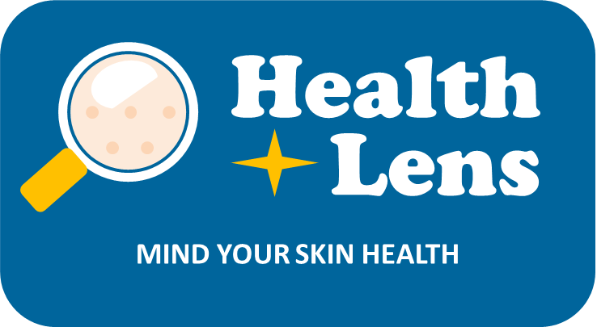

# Capstone Team C22-PS135 []
<!--
*** Thanks for checking out the Best-README-Template. If you have a suggestion
*** that would make this better, please fork the repo and create a pull request
*** or simply open an issue with the tag "enhancement".
*** Thanks again! Now go create something AMAZING! :D
***
***
***
*** To avoid retyping too much info. Search and replace for the following:
*** github_username, repo_name, twitter_handle, email, project_title, project_description
-->

<!-- PROJECT SHIELDS -->
<!--
*** I'm using markdown "reference style" links for readability.
*** Reference links are enclosed in brackets [ ] instead of parentheses ( ).
*** See the bottom of this document for the declaration of the reference variables
*** for contributors-URL, forks-URL, etc. This is an optional, concise syntax you may use.
*** https://www.markdownguide.org/basic-syntax/#reference-style-links
-->
<!-- [![Contributors][contributors-shield]][contributors-url]
[![Forks][forks-shield]][forks-url]
[![Stargazers][stars-shield]][stars-url]
[![Issues][issues-shield]][issues-url]
[![MIT License][license-shield]][license-url]
[![LinkedIn][linkedin-shield]][linkedin-url] -->

<!-- PROJECT LOGO -->
 

  
  
  <h2 align="center">Bangkit Capstone Project 2022: HealthLens (Deteksi Berbagai Penyakit Wajah)</h2>
  <h2 align="center">~ Mind Your Skin Health ~</h2>

  

    Documentation Available Here:
     
    ·
    <a href="https://github.com/TegarNH/Capstone-Project-C22-PS135/issues">Report Bug</a>
    ·
    <a href="">Endpoint Documentation</a>
  

 

<!-- TABLE OF CONTENTS -->

  
<h2 style="display: inline-block">Table of Contents</h2>

  <ol>
    <li>
      <a href="#about-the-project">About The Project</a>
      <ul>
        <li><a href="#built-with">Built With</a></li>
      </ul>
    </li>
    <li>
      <a href="#getting-started">Getting Started</a>
      <ul>
        <li><a href="#prerequisites">Prerequisites</a></li>
        <li><a href="#installation">Installation</a></li>
      </ul>
    </li>
    <li><a href="#usage">How to use</a></li>
    <li><a href="#contact">Contact us</a></li>
  </ol>

 
 

## About The Project

Nowadays, people are becoming aware about their facial health. Especially about their facial problems, specifically, like their skin doesn't look healthy, have acne, and problem skin-related.There are many kinds of skincare products with many variants like products, ingredients, and usefulness. The problems are people find it hard to identify which one skincare product is right for them because there are so many problems related to facial skin. The people aware of the skin do not look healthy, have acne, or problem skin.  
Thus, there are chances that people don't use the skincare product wisely and suitable for them and only just make their facial problem more severe for themselves. Chances are high because sometimes people use skincare without consulting the professional, before. Mainly because of the high cost for them and  there is a lack of professional facial doctors who could resolve the problem in their regions or residence. Briefly to conclude, we need some automation tools that could meet human professional-like intelligence for resolving the problems without being needed to consult a professional facial-skin doctor.

 

### Built With
* [Android Studio Chipmunk (2021.2.1 Patch 1)](https://developer.android.com/studio)
* [Kotlin Programming Language](https://kotlinlang.org/)
* [Google Cloud Platform Services](https://cloud.google.com/gcp)
* [Google Colaboratory](https://research.google.com/colaboratory/)
* [Python Programming Language (Version 3)](https://www.python.org/)
 
 

## Getting Started
### Prerequisites
1. Android 5.0 Lollipop (SDK 21) or above.
2. Internet Connection.
3. Good condition Front Camera.

### Installation
1. Download the APK Files [here](https://drive.google.com/file/d/1OdWTDYbW6O70uuBJVOS22GHq0XsITwgA/view?usp=sharing).
2. Install APK FIles (Allow permission install from Unknown Source).
 
 

## How to use
1. Open App.
2. Press the "Get Started" botton on Landing Page.
3. Select the desired Detection Type (Skin Disease or Skin Type).
3. Press the "Take a selfie" button to take a photo from the front camera, or press the "Upload from gallery" button to select a photo from the gallery.
4. If you choose "Take a selfie", you must give permission to use the camera on this app. Then take a photo by pressing the shutter button.
5. If you choose "Upload from Gallery", select the photo you want to detect, then crop the image and point it directly at your face.
6. if you want to re-take the photo, you can press the "Try Again" button. If not, press the "Procces" button to start the detection.
7. Please wait a moment, let HealthLens detect your facial skin and provide you with accurate results!
8. Now, The prediction about your skin type or skin problem has been out! You can also see recommendations for what to do to take care of your face and product recommendations based on your facial condition!
 
 

## Contact us
* Miftahul Ardli (M2011G1151) - [miftahul18002@mail.unpad.ac.id](mailto:miftahul18002@mail.unpad.ac.id)
* Ni Luh Melika Candra Widyani Mas (M2232F2123) - [melika.candra@gmail.com](mailto:melika.candra@gmail.com)
* Alvin Steven (C2007F0655) - [alvin.pin108@gmail.com](mailto:alvin.pin108@gmail.com)
* Muhammad Alwi Abdul Aziz (C7007F0656) - [112201906316@mhs.dinus.ac.id](mailto:112201906316@mhs.dinus.ac.id)
* Tegar Naufal Hanip (A7009F0996) - [tegarnaufalh@gmail.com](mailto:tegarnaufalh@gmail.com)
* Vinna Mariska (A2009f0997) - [vinna.mariska@gmail.com](mailto:vinna.mariska@gmail.com)
